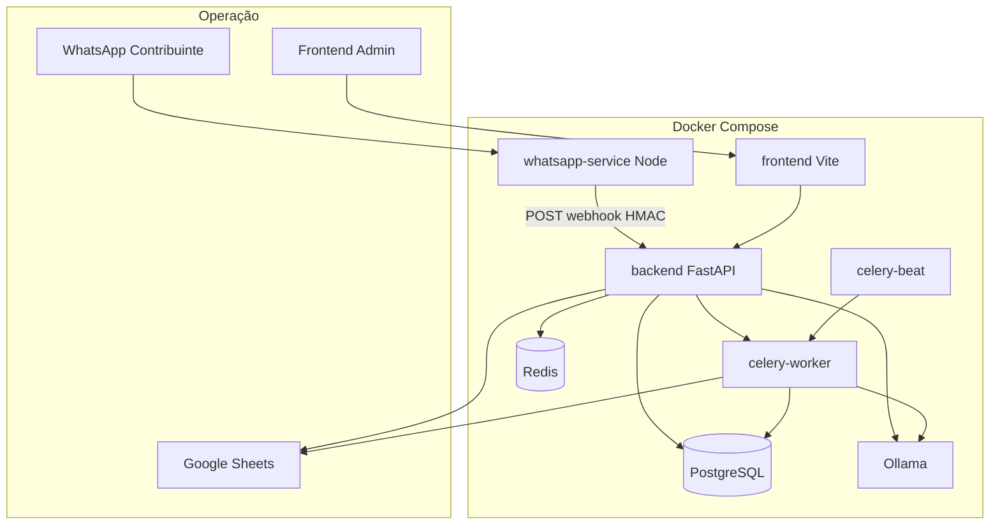
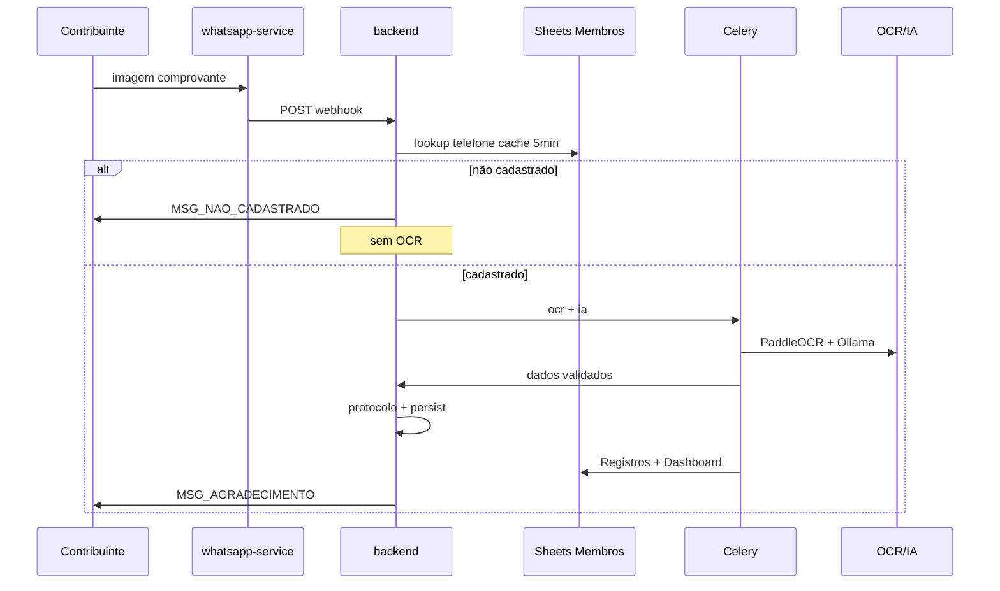
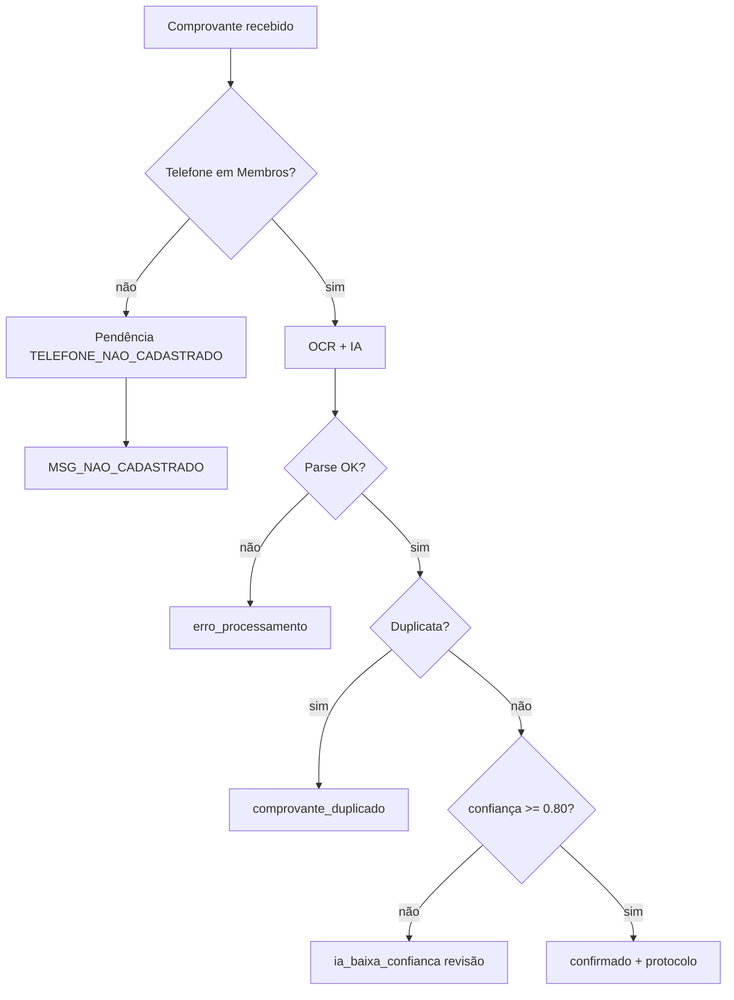

# CDB Shalom — Arquitetura

Sistema local de automação financeira para contribuições PIX via WhatsApp.

## Regra inviolável

A identidade do contribuinte é determinada **exclusivamente** pelo número de WhatsApp, consultado na aba **Membros** do Google Sheets (com cache Redis). A IA nunca identifica pessoas.

## Diagrama de componentes

## Happy path

## Caminhos de erro

## Camadas (Clean Architecture)

| Camada | Responsabilidade |
|--------|------------------|
| `domain` | Entidades, value objects, eventos, interfaces de repositório |
| `application` | Casos de uso, serviços de domínio, handlers de eventos |
| `infrastructure` | PostgreSQL, Redis, Sheets, OCR, Ollama, arquivos |
| `api` | FastAPI, middleware, DI |
| `tasks` | Celery (OCR, IA, Sheets, PDF, backup) |

## ADRs resumidas

1. **Identidade por telefone** — Sheets é fonte da verdade para membros; IA só extrai valor/data/banco.
2. **HTTP entre WhatsApp e backend** — Contrato simples vs WebSocket.
3. **SPA Vite** — Admin não precisa SSR; HMR rápido em dev.
4. **Protocolo via tabela `sequencias`** — `SELECT FOR UPDATE` evita race sem arquivo em disco.
5. **Logs com hash de telefone** — LGPD: `SHA256(telefone)[:8]` apenas.

## Comunicação entre serviços

| De | Para | Protocolo |
|----|------|-----------|
| whatsapp-service | backend | `POST /api/v1/webhooks/whatsapp` + HMAC |
| backend | whatsapp-service | `POST /send` (mensagens) |
| backend | Ollama | HTTP REST |
| celery | PostgreSQL, Redis, Sheets | async/sync conforme módulo |
