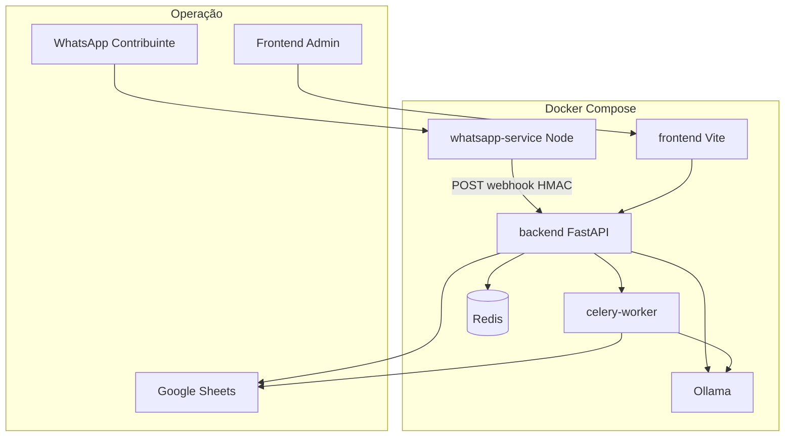
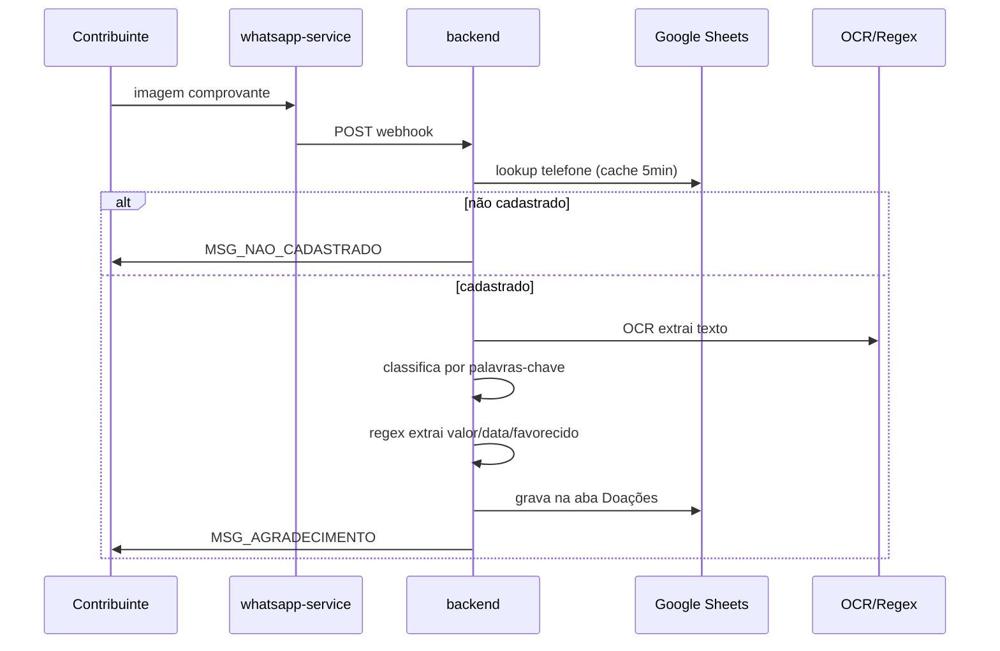
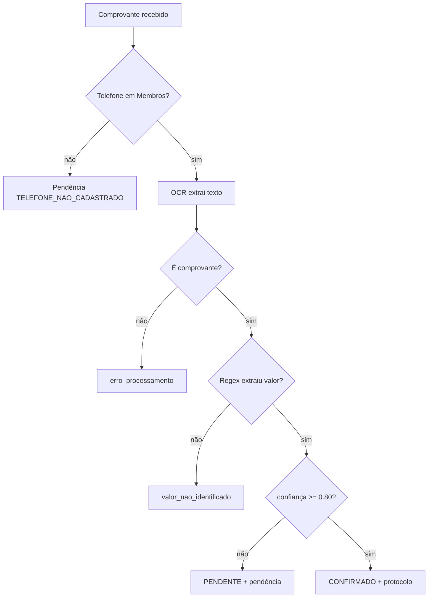

# CDB Shalom — Arquitetura

Sistema de automação financeira para contribuições PIX via WhatsApp.

> **Status atual (v6):** O sistema usa **Google Sheets como único banco de dados**.
> Não há mais dependência de PostgreSQL, SQLite ou qualquer banco SQL.
> A extração de dados de comprovantes é feita via **regex** (não IA).
> O modelo `llama3.2:1b` é usado apenas para classificação opcional.

## Regra inviolável

A identidade do contribuinte é determinada **exclusivamente** pelo número de WhatsApp, consultado na aba **Membros** do Google Sheets.

## Diagrama de componentes



## Happy path



## Caminhos de erro



## Camadas

| Camada | Responsabilidade |
|--------|------------------|
| `domain` | Enums (StatusContribuicao, MotivoPendencia), value objects |
| `application` | Casos de uso, serviços (OCR, WhatsApp, Sheets) |
| `infrastructure` | Google Sheets, Redis, Ollama, OCR engines |
| `api` | FastAPI, middleware |
| `tasks` | Celery (processamento OCR) |

## Fluxo de processamento

```
1. Imagem recebida via WhatsApp
2. whatsapp-service reencaminha para backend
3. Backend identifica membro pelo telefone (Sheets + cache Redis)
4. Celery task dispara processamento OCR
5. EasyOCR extrai texto bruto da imagem
6. Classificador por palavras-chave valida se é comprovante
7. Regex extrai: valor (R$), data (dd/mm/aaaa), favorecido
8. Status determinado por confiança:
   - >= 0.80: CONFIRMADO
   - < 0.80: PENDENTE
9. Dados salvos na aba Doações do Google Sheets
10. Protocolo gerado (YYYYMMDD-HASH6)
11. WhatsApp notifica o contribuinte
```

## Comunicação entre serviços

| De | Para | Protocolo |
|----|------|-----------|
| whatsapp-service | backend | `POST /api/v1/webhooks/whatsapp` + HMAC |
| backend | whatsapp-service | `POST /send` (mensagens) |
| backend | Ollama | HTTP REST (classificação opcional) |
| celery | Google Sheets | Google Sheets API v4 |

## Decisões de design

1. **Google Sheets como único banco** — Sem PostgreSQL/SQLite. Planilha é a fonte da verdade.
2. **Regex para extração** — Mais confiável que IA para modelos pequenos (1B params).
3. **Classificação por palavras-chave** — Primeiro filtro, rápido e sem dependência externa.
4. **Protocolo sem banco** — Gerado com timestamp + UUID curto (não precisa de tabela de sequências).
5. **Cache Redis para membros** — Consulta rápida ao telefone sem bater na planilha a cada imagem.